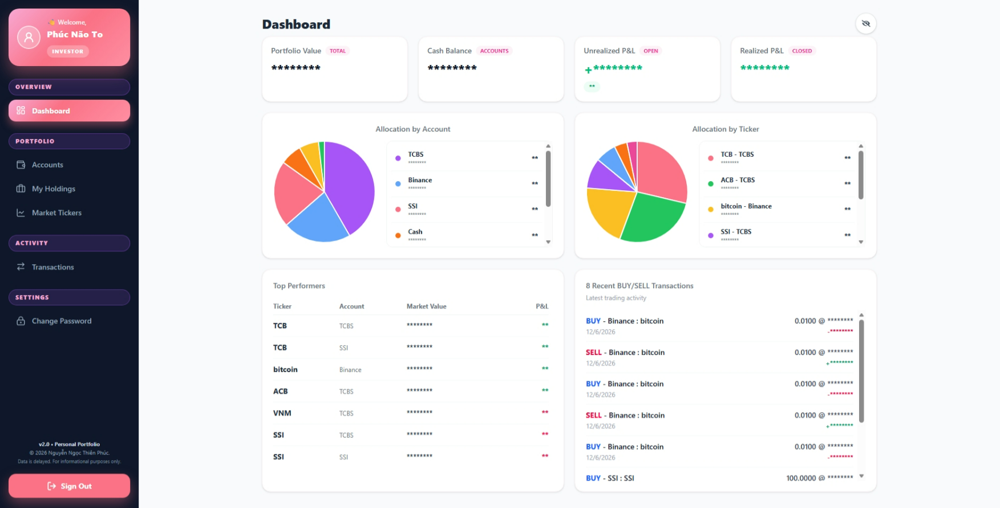

# Personal-Portfolio-Tracker-Website-V2

🚀 **Live Demo:** [app.nnthienphuc.me](https://app.nnthienphuc.me/)

---

# 🇻🇳 Giới thiệu
Ứng dụng quản lý tài sản cá nhân toàn diện, giúp bạn kiểm soát dòng tiền từ tiền mặt, sổ tiết kiệm đến các danh mục đầu tư chứng khoán và tiền điện tử. Với cơ chế cập nhật giá thị trường, bạn luôn nắm bắt được hiệu suất tài sản mọi lúc, mọi nơi.

## 🌟 Tính năng nổi bật
* **Dashboard trực quan:** Theo dõi nhanh `Portfolio Value`, `Cash Balance` cùng hiệu suất `Unrealized P&L` (vị thế đang mở) và `Realized P&L` (vị thế đã chốt). Biểu đồ phân bổ giúp bạn biết chính xác tỷ trọng tài sản đang nằm ở Account nào và Ticker nào.
* **Quản lý danh mục (Holdings):** Theo dõi P&L theo thời gian thực. Đặc biệt, hỗ trợ theo dõi **Target Price** để chủ động kế hoạch mua/bán.
* **Công cụ phân tích:** Cho phép đính kèm ảnh chụp biểu đồ (chart) vào ghi chú (Note) giao dịch để lưu lại lý do đầu tư, hỗ trợ kỷ luật trong giao dịch.
* **Đa nguồn dữ liệu:** Tích hợp dữ liệu thị trường uy tín, đảm bảo độ chính xác cao.
* **Responsive UI:** Giao diện tối ưu hoàn hảo cho cả Desktop và Mobile, nhập liệu nhanh chóng ngay trên điện thoại.

## 📋 Hướng dẫn sử dụng
### 1. Thiết lập tài khoản (Accounts)
Tạo các "Account" tương ứng với ví thực tế (Ví dụ: TCBS, Binance, Tiền mặt). Lưu ý phân loại đúng loại tài khoản để hệ thống tính toán hiệu suất chính xác.

### 2. Quản lý danh mục đầu tư & Target
* **Mua (BUY):** Hệ thống tự động trừ tiền từ `Available Cash` và cộng dồn vào `Invested Balance`.
* **Thiết lập mục tiêu (Targets):** Tại trang `Holdings`, bạn có thể thiết lập giá mục tiêu (Target Price) để theo dõi các điểm mua/bán tối ưu.
* **Ghi chú chuyên sâu:** Sử dụng tính năng Note để lưu lại ảnh chụp phân tích kỹ thuật (Chart), giúp bạn tối ưu hóa chiến lược đầu tư.

### 3. Nhập dữ liệu tài sản cũ (Import Holding)
1. Nhập số tiền vốn hiện có vào `Account`.
2. Tạo giao dịch "Mua" với số lượng và giá vốn thực tế.
3. Đặt **FEE Rate là 0%** để giữ nguyên giá vốn ban đầu.

---

# 🇺🇸 About the Project
A professional-grade portfolio management tool designed to track your financial journey. Monitor your cash, savings, and investments (Stocks/Crypto) with near real-time updates and advanced analytics.

## 🌟 Key Features
* **Intuitive Dashboard:** Get an instant snapshot of your `Portfolio Value`, `Cash Balance`, along with `Unrealized P&L` (open positions) and `Realized P&L` (closed profits). Allocation charts help you instantly see where your capital is distributed.
* **Portfolio Holdings:** Real-time P&L tracking. Set your **Target Prices** to plan your next buy/sell move with confidence.
* **Visual Analysis:** Enhance your trading discipline by attaching chart snapshots directly to your transaction notes.
* **Multi-Source Data:** Reliable data integration from market APIs.
* **Mobile-First Design:** Optimized for on-the-go tracking and quick transaction entry.

## 📋 How to get started
### 1. Account Management
Create accounts that mirror your real-world assets (Securities Brokerage, Crypto Wallets, Cash).

### 2. Trading & Analytics
* **BUY Transactions:** Funds are automatically deducted from `Available Cash` and updated into your `Invested Balance`.
* **Target Tracking:** Use the `Holdings` page to set and monitor your target prices.
* **Trading Journal:** Use the Note feature to upload your technical analysis charts, turning your portfolio into a structured trading diary.

### 3. Importing Existing Holdings
1. Input your current invested capital into the relevant account.
2. Record a "BUY" transaction with your actual quantity and cost price.
3. Set the **FEE Rate to 0%** to preserve your cost basis.

---

## 🖼️ Preview
| Dashboard | Accounts |
| :--- | :--- |
|  |  |

| Holdings & Targets | Market Tickers |
| :--- | :--- |
|  |  |

**Transactions**

---
> ⚠️ **Disclaimer:** Dữ liệu thị trường có độ trễ (khoảng 4 phút) và chỉ mang tính chất tham khảo. / *Market data is delayed (approx. 4 mins) and for informational purposes only.*