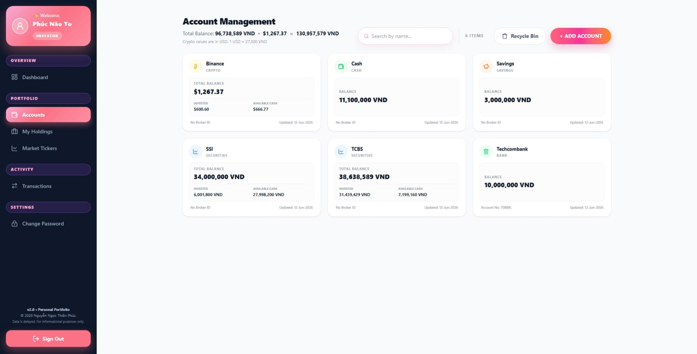
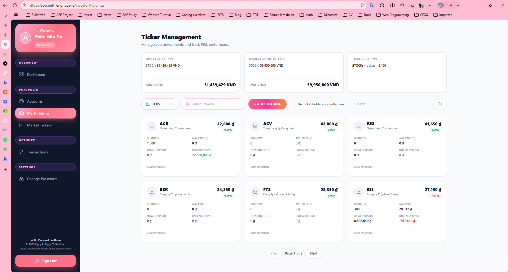
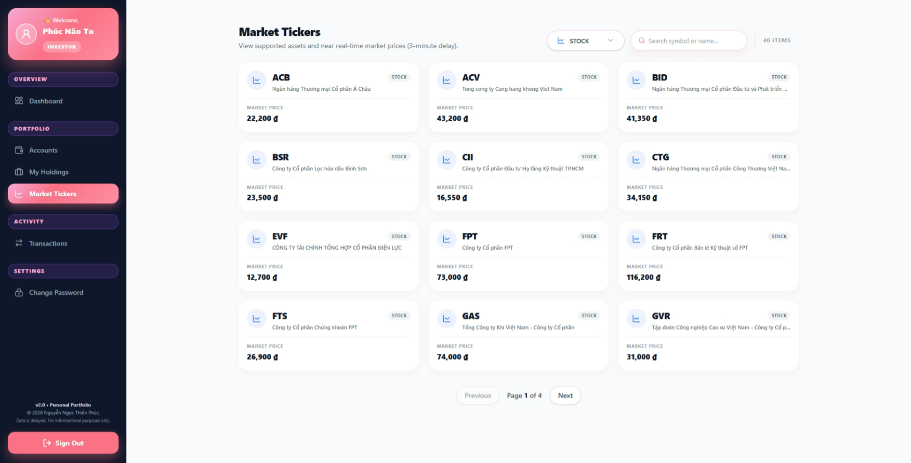
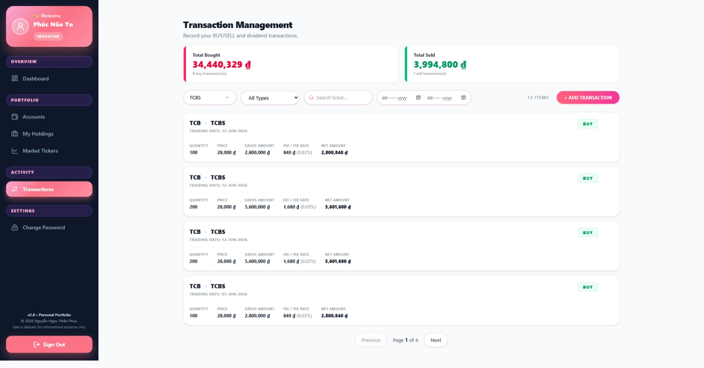
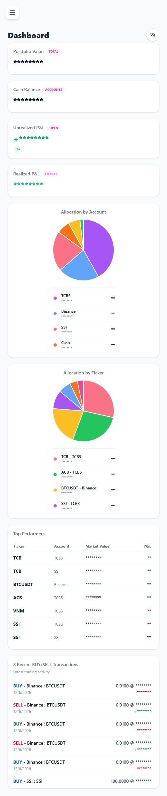
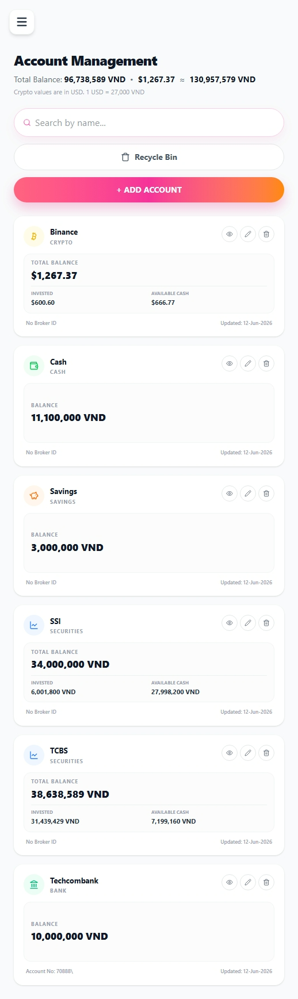
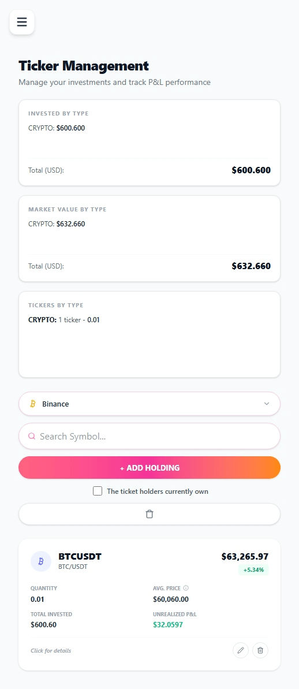
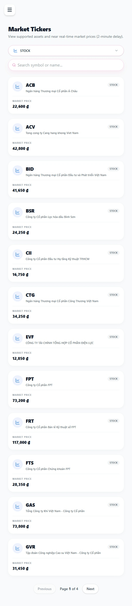
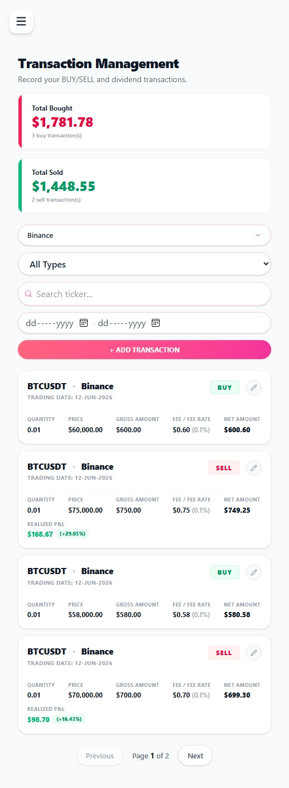

# Portfolio Tracker V2

🚀 **Live Demo:** [app.nnthienphuc.me](https://app.nnthienphuc.me/)

A comprehensive, professional-grade wealth management platform. Monitor your cash, bank accounts, credit, savings, and investments (Stocks/Crypto) with near real-time updates and advanced analytics.
*(Quản lý tài sản cá nhân toàn diện, kiểm soát dòng tiền từ tiền mặt, ngân hàng, tín dụng, tiết kiệm đến chứng khoán và tiền điện tử. Hiệu suất tài sản luôn trong tầm tay.)*

---

## 🌟 Key Features / Tính năng nổi bật

* **📊 Intuitive Dashboard (Dashboard trực quan):**
  Instant snapshot of Portfolio Value, Cash Balance, and P&L with clear asset allocation charts. 
  *(Theo dõi nhanh tổng tài sản, số dư tiền mặt cùng hiệu suất P&L với biểu đồ phân bổ chi tiết.)*
* **🎯 Portfolio Holdings (Quản lý danh mục):**
  Real-time P&L tracking. Set your Target Prices to plan your next buy/sell moves with confidence.
  *(Theo dõi P&L thời gian thực. Hỗ trợ thiết lập giá mục tiêu để chủ động kế hoạch giao dịch.)*
* **📈 Visual Analysis (Công cụ phân tích):**
  Enhance your trading discipline by attaching chart snapshots directly to your transaction notes.
  *(Đính kèm ảnh chụp biểu đồ vào ghi chú giao dịch để lưu lại lý do đầu tư, duy trì kỷ luật.)*
* **🌐 Multi-Source Data (Đa nguồn dữ liệu):**
  Reliable data integration from trusted market APIs ensuring high accuracy for your portfolio.
  *(Tích hợp dữ liệu thị trường uy tín, liên tục cập nhật để đảm bảo độ chính xác cao nhất.)*
* **📱 Mobile-First Design (Giao diện Responsive):**
  Optimized for on-the-go tracking, allowing quick transaction entries directly from your smartphone.
  *(Tối ưu hoàn hảo cho cả Desktop và Mobile, giúp bạn cập nhật danh mục mọi lúc mọi nơi.)*
* **🛡️ Secure & Private (Bảo mật & Riêng tư):**
  Your financial data remains strictly confidential with modern security standards and encryption.
  *(Dữ liệu tài chính là của riêng bạn. Hệ thống áp dụng tiêu chuẩn bảo mật hiện đại nhất.)*

---

## 📋 How to get started / Hướng dẫn sử dụng

### Step 1: Account Setup (Thiết lập tài khoản)
Create accounts that mirror your real-world assets (e.g., Securities Brokerage, Crypto Wallets, Cash, Banks). Categorize correctly for accurate performance tracking.
*(Tạo các "Account" tương ứng với ví thực tế. Lưu ý phân loại đúng loại tài khoản để hệ thống tính toán chính xác.)*

### Step 2: Trading & Analytics (Giao dịch & Mục tiêu)
* **BUY Transactions:** Funds are automatically deducted from Available Cash and updated into Invested Balance.
* **Target & Notes:** Use the Holdings page to set target prices. Use the Note feature to upload technical analysis charts.
*(Lệnh Mua tự động trừ tiền từ Cash. Sử dụng trang Holdings để đặt Target và dùng Note lưu ảnh phân tích kỹ thuật.)*

### Step 3: Importing Existing Holdings (Nhập dữ liệu cũ)
If you already hold assets, follow these 3 strict steps to set up your cost basis:
1. **Input Capital:** Input your current invested capital into the relevant account.
2. **Record a BUY:** Create a "BUY" transaction with your actual quantity and original cost price.
3. **Zero Fee:** Set the **FEE Rate to 0%** to preserve your initial cost basis without triggering additional deductions.
*(1. Nhập vốn vào Account. 2. Tạo giao dịch Mua với giá vốn thực tế. 3. Đặt Phí 0% để giữ nguyên giá vốn ban đầu.)*

---

## 🖼️ Product Tour (Desktop)

| Account Management | Portfolio Holdings |
| :--- | :--- |
|  |  |

| Market Tickers | Transaction History |
| :--- | :--- |
|  |  |

## 📱 Mobile Experience

The platform is fully optimized for mobile devices, giving you total control of your portfolio anytime, anywhere.

<table>
  <tr>
    <th align="center">Dashboard</th>
    <th align="center">Accounts</th>
    <th align="center">Holdings</th>
    <th align="center">Market</th>
    <th align="center">Transactions</th>
  </tr>
  <tr valign="top">
    <td align="center"></td>
    <td align="center"></td>
    <td align="center"></td>
    <td align="center"></td>
    <td align="center"></td>
  </tr>
</table>

---
> ⚠️ **Disclaimer:** Market data is delayed (approx. 2 mins) and for informational purposes only. / *Dữ liệu thị trường có độ trễ khoảng 2 phút và chỉ mang tính chất tham khảo.*